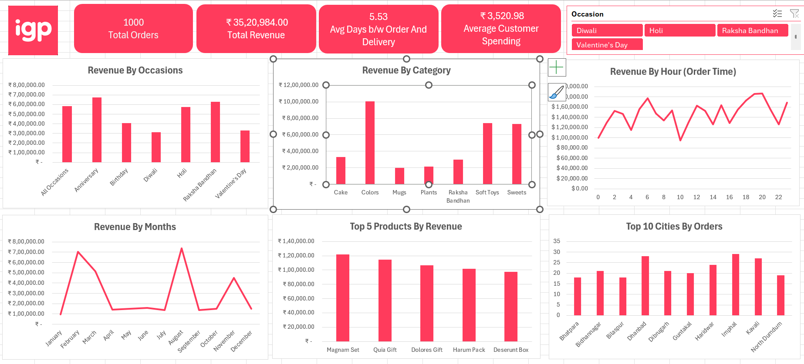

# 📊 IGP E-Commerce Sales & Customer Analysis

## 🧾 Project Overview

This project analyzes e-commerce sales data to uncover insights into **customer behavior, revenue trends, product performance, and operational efficiency** using Microsoft Excel.

The goal is to simulate real-world business analysis and provide **data-driven recommendations** to improve revenue and customer experience.

---

##  Objectives

* Analyze overall sales performance
* Identify high-performing occasions and product categories
* Understand customer purchasing behavior
* Evaluate delivery efficiency
* Generate actionable business insights

---

##  Dataset Information

* **Source:** Sample E-commerce Dataset (IGP-inspired)
* **Total Orders:** 1,000
* **Key Fields:**

  * Order ID
  * Order Date & Delivery Date
  * Product Category
  * Occasion
  * Revenue
  * Customer Information
  * City

---

##  Tools & Techniques Used

* Microsoft Excel
* Pivot Tables & Pivot Charts
* Power Query (Data Cleaning)
* Dashboard Design & Data Visualization
* KPI Metrics

---

##  Dashboard Features

###  Key Metrics (KPIs)

* Total Orders
* Total Revenue
* Average Customer Spending
* Average Delivery Time

###  Visual Analysis

* Revenue by Occasion
* Revenue by Category
* Revenue by Month
* Revenue by Order Time (Hourly Trends)
* Top 5 Products by Revenue
* Top 10 Cities by Orders

---

##  Dashboard Preview

---

##  Key Insights

* Revenue is highly **seasonal and occasion-driven**
* **Anniversary and Raksha Bandhan** contribute the most revenue
* **Top categories** include Colors, Soft Toys, and Sweets
* Orders peak during **morning and evening hours**
* Strong demand observed in **Tier 2 and Tier 3 cities**
* Delivery time averages **5.53 days**, indicating scope for improvement

---

##  Business Recommendations

* Focus marketing on **high-performing occasions**
* Promote **top product categories** and bundle low-performing ones
* Run campaigns during **peak order hours**
* Optimize logistics to **reduce delivery time**
* Expand operations in **high-demand non-metro cities**

---

##  How to Use

1. Download the Excel dashboard file
2. Open in Microsoft Excel (2016 or later recommended)
3. Use filters/slicers to explore insights dynamically

---

##  Project Highlights

* End-to-end Excel data analysis project
* Business-focused insights and recommendations
* Interactive dashboard for decision-making
* Real-world use case simulation

---

##  Future Improvements

* Add customer segmentation (RFM Analysis)
* Build predictive sales forecasting
* Integrate Power BI for advanced visualization
* Perform cohort and retention analysis

---

##  Author

**Harish Kumar**
Aspiring Data / Business Analyst

---
