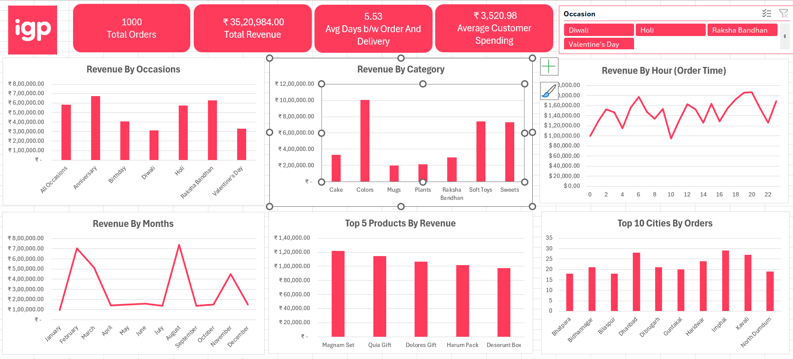

# 🎁 IGP E-Commerce Sales & Customer Analysis

## 📌 Project Overview

This project analyzes **1,000 e-commerce orders** from IGP (Indian Gifts Portal) using **Microsoft Excel** to uncover insights into sales performance, customer purchasing behavior, product demand, seasonality, and delivery efficiency. The objective is to transform raw transactional data into actionable business recommendations through an interactive Excel dashboard.

---

## 🎯 Business Problem

IGP aims to better understand customer purchasing patterns, identify key revenue drivers, optimize inventory and marketing strategies, and improve operational performance. This analysis answers questions such as:

* Which occasions generate the highest revenue?
* Which product categories contribute the most sales?
* How do customer orders vary by month and hour?
* Which cities generate the highest order volume?
* Is the current delivery performance meeting customer expectations?

---

## 🛠️ Tools & Skills

* Microsoft Excel
* Pivot Tables & Pivot Charts
* Power Query
* Data Cleaning
* Conditional Formatting
* Dashboard Design
* Business Analytics
* Data Visualization

---

## 📊 Dashboard Metrics

| Metric                 |       Value |
| ---------------------- | ----------: |
| Total Orders           |       1,000 |
| Total Revenue          | ₹35.2 Lakhs |
| Average Customer Spend |      ₹3,520 |
| Average Delivery Time  |   5.53 Days |

---

## 📈 Key Insights

### Revenue Analysis

* Revenue is highly seasonal and concentrated around specific occasions.
* A small number of events contribute a significant share of total sales.

### Occasion Performance

**Top Performing Occasions**

* Anniversary
* Raksha Bandhan
* Holi

**Underperforming Occasions**

* Diwali
* Valentine's Day

### Product Category Analysis

**Highest Revenue Categories**

* Colors
* Soft Toys
* Sweets

**Lowest Revenue Categories**

* Mugs
* Plants

### Monthly Trends

**Peak Months**

* February
* August
* November

**Low Sales Period**

* April – July

### Customer Order Behavior

**Peak Order Hours**

* 6 AM – 8 AM
* 6 PM – 8 PM

Orders are primarily placed during leisure hours, making these ideal windows for promotional campaigns.

### Geographic Analysis

Top demand originated from:

* Imphal
* Dhanbad
* Kavali

The analysis indicates strong demand from Tier 2 and Tier 3 cities.

### Delivery Performance

* Average delivery time: **5.53 days**

This highlights opportunities to improve fulfillment speed and customer satisfaction.

---

## 💡 Business Recommendations

* Increase marketing investment during high-performing occasions.
* Launch promotional campaigns during low-demand months.
* Prioritize inventory for best-selling product categories.
* Bundle low-performing products with top-selling items.
* Schedule advertisements during peak ordering hours.
* Improve logistics to reduce delivery times.
* Expand localized marketing in high-demand Tier 2 and Tier 3 cities.

---

## 📌 Project Outcomes

* Identified key revenue drivers and seasonal purchasing patterns.
* Uncovered customer ordering behavior across time and geography.
* Highlighted opportunities to optimize marketing, inventory planning, and logistics.
* Delivered actionable business recommendations through an interactive Excel dashboard.

---

## 🚀 Resume Highlights

* Analyzed **1,000 e-commerce transactions** using **Microsoft Excel (Pivot Tables, Power Query, Pivot Charts, Dashboards)** to identify sales trends, customer behavior, and operational insights.
* Evaluated **occasion-wise, category-wise, geographic, and time-based performance**, delivering recommendations to optimize marketing, inventory, and delivery operations.

---

## 📷 Dashboard Preview

> Add a screenshot of your Excel dashboard here.

```
dashboard.png
```

---

## 📂 Project Structure

```
IGP-Ecommerce-Sales-Analysis/
│
├── Dataset/
│   └── IGP_Ecommerce_Data.xlsx
│
├── Dashboard/
│   └── IGP_Sales_Dashboard.xlsx
│
├── Images/
│   └── dashboard.png
│
└── README.md
```

---

## 📌 Conclusion

This project demonstrates how Excel can be used as a business intelligence tool to analyze e-commerce performance, uncover customer behavior patterns, and generate data-driven recommendations that support strategic decision-making.


# 🎁 IGP E-Commerce Sales & Customer Analysis

## 📌 Project Overview

This project analyzes **1,000 e-commerce orders** from IGP (Indian Gifts Portal) using **Microsoft Excel** to uncover insights into sales performance, customer purchasing behavior, product demand, seasonality, and delivery efficiency. The objective is to transform raw transactional data into actionable business recommendations through an interactive Excel dashboard.

---

## 🎯 Business Problem

IGP aims to better understand customer purchasing patterns, identify key revenue drivers, optimize inventory and marketing strategies, and improve operational performance. This analysis answers questions such as:

* Which occasions generate the highest revenue?
* Which product categories contribute the most sales?
* How do customer orders vary by month and hour?
* Which cities generate the highest order volume?
* Is the current delivery performance meeting customer expectations?

---

## 🛠️ Tools & Skills

* Microsoft Excel
* Pivot Tables & Pivot Charts
* Power Query
* Data Cleaning
* Conditional Formatting
* Dashboard Design
* Business Analytics
* Data Visualization

---

## 📊 Dashboard Metrics

| Metric                 |       Value |
| ---------------------- | ----------: |
| Total Orders           |       1,000 |
| Total Revenue          | ₹35.2 Lakhs |
| Average Customer Spend |      ₹3,520 |
| Average Delivery Time  |   5.53 Days |

---

## 📈 Key Insights

### Revenue Analysis

* Revenue is highly seasonal and concentrated around specific occasions.
* A small number of events contribute a significant share of total sales.

### Occasion Performance

**Top Performing Occasions**

* Anniversary
* Raksha Bandhan
* Holi

**Underperforming Occasions**

* Diwali
* Valentine's Day

### Product Category Analysis

**Highest Revenue Categories**

* Colors
* Soft Toys
* Sweets

**Lowest Revenue Categories**

* Mugs
* Plants

### Monthly Trends

**Peak Months**

* February
* August
* November

**Low Sales Period**

* April – July

### Customer Order Behavior

**Peak Order Hours**

* 6 AM – 8 AM
* 6 PM – 8 PM

Orders are primarily placed during leisure hours, making these ideal windows for promotional campaigns.

### Geographic Analysis

Top demand originated from:

* Imphal
* Dhanbad
* Kavali

The analysis indicates strong demand from Tier 2 and Tier 3 cities.

### Delivery Performance

* Average delivery time: **5.53 days**

This highlights opportunities to improve fulfillment speed and customer satisfaction.

---

## 💡 Business Recommendations

* Increase marketing investment during high-performing occasions.
* Launch promotional campaigns during low-demand months.
* Prioritize inventory for best-selling product categories.
* Bundle low-performing products with top-selling items.
* Schedule advertisements during peak ordering hours.
* Improve logistics to reduce delivery times.
* Expand localized marketing in high-demand Tier 2 and Tier 3 cities.

---

## 📌 Project Outcomes

* Identified key revenue drivers and seasonal purchasing patterns.
* Uncovered customer ordering behavior across time and geography.
* Highlighted opportunities to optimize marketing, inventory planning, and logistics.
* Delivered actionable business recommendations through an interactive Excel dashboard.

---

## 🚀 Resume Highlights

* Analyzed **1,000 e-commerce transactions** using **Microsoft Excel (Pivot Tables, Power Query, Pivot Charts, Dashboards)** to identify sales trends, customer behavior, and operational insights.
* Evaluated **occasion-wise, category-wise, geographic, and time-based performance**, delivering recommendations to optimize marketing, inventory, and delivery operations.

---

## 📷 Dashboard Preview

> Add a screenshot of your Excel dashboard here.

```
dashboard.png
```

---

## 📂 Project Structure

```
IGP-Ecommerce-Sales-Analysis/
│
├── Dataset/
│   └── IGP_Ecommerce_Data.xlsx
│
├── Dashboard/
│   └── IGP_Sales_Dashboard.xlsx
│
├── Images/
│   └── dashboard.png
│
└── README.md
```

---

## 📌 Conclusion

This project demonstrates how Excel can be used as a business intelligence tool to analyze e-commerce performance, uncover customer behavior patterns, and generate data-driven recommendations that support strategic decision-making.


# 📊 IGP E-Commerce Sales & Customer Analysis

## 🧾 Project Overview

This project analyzes e-commerce sales data to uncover insights into **customer behavior, revenue trends, product performance, and operational efficiency** using Microsoft Excel.

The goal is to simulate real-world business analysis and provide **data-driven recommendations** to improve revenue and customer experience.

---

##  Objectives

* Analyze overall sales performance
* Identify high-performing occasions and product categories
* Understand customer purchasing behavior
* Evaluate delivery efficiency
* Generate actionable business insights

---

##  Dataset Information

* **Source:** Sample E-commerce Dataset (IGP-inspired)
* **Total Orders:** 1,000
* **Key Fields:**

  * Order ID
  * Order Date & Delivery Date
  * Product Category
  * Occasion
  * Revenue
  * Customer Information
  * City

---

##  Tools & Techniques Used

* Microsoft Excel
* Pivot Tables & Pivot Charts
* Power Query (Data Cleaning)
* Dashboard Design & Data Visualization
* KPI Metrics

---

##  Dashboard Features

###  Key Metrics (KPIs)

* Total Orders
* Total Revenue
* Average Customer Spending
* Average Delivery Time

###  Visual Analysis

* Revenue by Occasion
* Revenue by Category
* Revenue by Month
* Revenue by Order Time (Hourly Trends)
* Top 5 Products by Revenue
* Top 10 Cities by Orders

---

##  Dashboard Preview





---

##  Key Insights

* Revenue is highly **seasonal and occasion-driven**
* **Anniversary and Raksha Bandhan** contribute the most revenue
* **Top categories** include Colors, Soft Toys, and Sweets
* Orders peak during **morning and evening hours**
* Strong demand observed in **Tier 2 and Tier 3 cities**
* Delivery time averages **5.53 days**, indicating scope for improvement

---

##  Business Recommendations

* Focus marketing on **high-performing occasions**
* Promote **top product categories** and bundle low-performing ones
* Run campaigns during **peak order hours**
* Optimize logistics to **reduce delivery time**
* Expand operations in **high-demand non-metro cities**

---


##  How to Use

1. Download the Excel dashboard file
2. Open in Microsoft Excel (2016 or later recommended)
3. Use filters/slicers to explore insights dynamically

---

##  Project Highlights

* End-to-end Excel data analysis project
* Business-focused insights and recommendations
* Interactive dashboard for decision-making
* Real-world use case simulation

---

##  Future Improvements

* Add customer segmentation (RFM Analysis)
* Build predictive sales forecasting
* Integrate Power BI for advanced visualization
* Perform cohort and retention analysis

---

##  Author

**Harish Kumar**
Aspiring Data / Business Analyst

---
